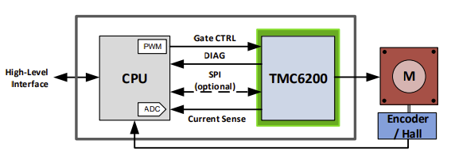

# motor-driver

This motor driver uses inline current sensing.  The driver chip built in current sensing.

# Diagram

# TMC6200 Gate Driver

Design uses TMC6200 gate driver 

Universal high voltage BLDC/PMSM/Servo MOSFET 3-halfbridge gate-driver with in line motor current sensing. External MOSFETs for up to 100A motor current. 3 Floating Sense Amplifiers with programmable gain (5, 10, 20)

Integrated current sense amplifiers eliminate costly sense amplifiers required for FOC controllers (recommended use for applications up to 10A, use external precision amplifiers for higher current with low sense resistor values)

THE TMC6200 OFFERS TWO BASIC MODES OF OPERATION: 

MODE 1: Stand-alone driver with pin configuration 
Enable this mode by tying low pin SPE. The interface pins allow a number of different settings for
BBM generation and sense amplifier amplification control. 

MODE 2: SPI controlled 
This mode allows detailed control over the protection, diagnostic and control features, e.g. for tuning
overcurrent detection. Enable this mode by tying high pin SPE.

The driver integrates a four-level temperature sensor (120°C pre-warning and selectable 136°C / 143°C / 150°C thermal shutdown)

The TMC6200 protects the MOSFET power stages against a short circuit or overload condition by monitoring the voltage drop in the high-side MOSFETs, as well as the voltage drop in the low-side mosfets

# Design Discussion

The TMC6200 IC current sensing is limited to 10A.  The thermal design of the PCB is also designed for 10A max current.  The 10A limit is chosen to allow full SMT and single side hole through components with 1oz copper.

Heatsink over the gate driver and mosfets is required over a certain current.  28x28x20 is a standard heat sink size and is added to the pcb using silicon thermal glue.

Initial parts were selected based on the Trinamic reference designs that I have copied into this git repo.

Footprint for capacitors and resistors choosen as 0603 to make it easier to manufacture with low end SMD machines.

Parts are selected that are available in quantity from various resellers due to current chip shortage.  Avoided any parts that were only available in small quantities or not in stock.

Sense resistor selection. TMC6200 datasheet specifies different sense resistor selection.  Sense resistor of 005R0 was selected for 20A max current 10A continuous.

In addition to the TMC6200 internal temperature sensor, there is a temperature sensor on the board.  The analog temperature signal is sent out the controller.

Mosfet selection.  Reference design has via for +VM connection through SMT pad.  This limits the vendor ability to manufacture the board and increases cost due to those needed to be capped in the manufacturing process.  Alternative is to put the via next to the SMT pad.

# Design Discussion for TMC6200 Pins 

See TMC6200 datasheet for full documentation of pins.  Below is specific decisions taken when choice was given.

CLK 24 DI is tied to GND using short wire for internal clock.  This clock has accuracy of +-4%

Exposed die pad: Connect the exposed die pad to a GND plane. Provide as many as possible vias for heat transfer to GND plane.  Reference design has via for GND connection through SMT pad.  This limits the vendor ability to manufacture the board and increases cost due to those needed to be capped in the manufacturing process.  Alternative is to put the via next to the SMT pad.

# Part selection

| Type| Designator| Footprint| Discussion | 
| :---:  | :-:       | :-:      |  :-: |
| TerminalBlock_3_P5.08mm| U3| Libraries:TerminalBlock_bornier-3_P5.08mm| Should support 18A to 20A max current though design current is 10A | 
| 1nF/100V| C14 C12 C11| Capacitor_SMD:C_0603_1608Metric|  |
| TerminalBlock_2_P5.08mm| U2| Libraries:TerminalBlock_bornier-2_P5.08mm| |
| 330uF/63V| C15 C16| Capacitor_THT:C_Radial_D10.0mm_H20.0mm_P5.00mm| TMC6200 datasheet recommends 100uF of electroltyic capacitor for each amp of current expected.  Total 660 uF for 10 Amps included. 10000 hour life, low impedance, low ESR, high ripple current rating  |
| VCC_IO| J2| Connector_JST:JST_PH_B2B-PH-K_1x02_P2.00mm_Vertical| |
| 1000R/1%| R19 R21| Resistor_SMD:R_0603_1608Metric| |
| 19-217/GHC-YR1S2/3T| D1 D2| LED_SMD:LED_0603_1608Metric| |
| 150R/1%| R20| Resistor_SMD:R_0603_1608Metric| |
| 4700R/1%| R18 R17 R24| Resistor_SMD:R_0603_1608Metric| |
| 10000R/1%| R16| Resistor_SMD:R_0603_1608Metric| |
| 100nF/50V| C17 C20 C10| Capacitor_SMD:C_0603_1608Metric| |
| Temperature| J5| Connector_JST:JST_PH_B2B-PH-K_1x02_P2.00mm_Vertical| |
| PWMx6| J3| Connector_JST:JST_PH_B6B-PH-K_1x06_P2.00mm_Vertical| |
| 0R| R22| Resistor_SMD:R_0603_1608Metric| |
| 1500R/1%| R23| Resistor_SMD:R_0603_1608Metric| |
| Current Sensing| J6| Connector_JST:JST_PH_B3B-PH-K_1x03_P2.00mm_Vertical| |
| SPI/Info| J1| Connector_JST:JST_PH_B6B-PH-K_1x06_P2.00mm_Vertical| |
| 0R| R26| Resistor_SMD:R_0603_1608Metric| |
| 0Ω| R25| Resistor_SMD:R_0603_1608Metric| |
| 2.2uF/50V| C13 C19| Capacitor_SMD:C_0805_2012Metric| |
| 100nF/100V| C18| Capacitor_SMD:C_0805_2012Metric| |
| TMC6200-TA| IC1| Libraries:TMC6200-TA| |
| 2R2/1%| R4 R6 R11 R13 R3 R1| Resistor_SMD:R_0603_1608Metric| slope control resistors.  1Ohm to 2.2Ohm recommended for larger MOSFETs. |
| 10R/1%| R5 R12 R2| Resistor_SMD:R_0603_1608Metric| |
| 0R005/1%/1W| R9 R10 R14 R15 R7 R8| Resistor_SMD:R_1206_3216Metric| Use low inductivity SMD type, e.g. 1210 or 2512 resistor for RS|
| 4.7uF/100V| C8 C9 C7| Capacitor_SMD:C_1210_3225Metric| |
| 4.7uF/16V| C5 C4 C6| Capacitor_SMD:C_0603_1608Metric| Bootstrap capacitors.  for larger QG - use minimum 4.7µF on 12VOUT pin. QG is 59.5nC at VDS=48V, VGS=10V, ID=20A |
| 22nF/100V| C1| Capacitor_SMD:C_0603_1608Metric| |
| 100nF/100V| C2 C3| Capacitor_SMD:C_0603_1608Metric| |
| HYG025N06LS1C2| Q2 Q6 Q4 Q3 Q1 Q5| Libraries:PDFN-8| 60V minimum, 2.5ohm max Rds(on) and fast switching for lower heat dissipation, Max current > 30A|

